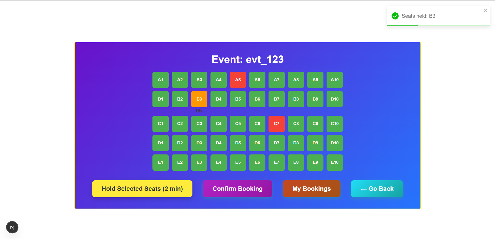

# Real-Time Seat Booking System

A mini seat booking system built with **Next.js, Node.js, MongoDB, and Redis**.  
It simulates platforms like BookMyShow, allowing users to view, hold, and confirm seats in real time.

---

## **Table of Contents**
- [Features](#features)
- [Tech Stack](#tech-stack)
- [Installation](#installation)
- [API Endpoints](#api-endpoints)
- [Seat States & Logic](#seat-states--logic)
- [Usage](#usage)
- [Edge Cases](#edge-cases)
- [Screeshots](#screenshots)

---

## **Features**
- View event seats in real time (50 seats per event)
- Hold seats for **2 minutes** (temporary lock)
- Confirm booking before hold expires
- Automatic release of seats after hold expires
- Prevent race conditions: two users cannot hold the same seat simultaneously
- Countdown timers for held seats
- Toast notifications for actions
- My Bookings page to view all bookings by a user

---

## **Tech Stack**
- **Frontend:** Next.js, React, React-Toastify
- **Backend:** Node.js, Express (via Next.js API routes)
- **Database:** MongoDB (Mongoose)
- **Cache/Locking:** Redis (for seat holds with TTL)

---

## **Installation**
1. Clone the repository

2. Install dependencies

3. Configure environment variables
   - MONGO_URI=<your_mongo_connection_string>
   - REDIS_URL=<your_redis_connection_string>
   - EVENT_ID=evt_123

4. Run development servers:
   - yarn dev

## **API Endpoints** 
1. Get Seat Map: GET /api/event/:eventId/seats

2. Hold Seats: POST /api/event/:eventId/hold

3. Confirm Booking: POST /api/event/:eventId/confirm

4. My Bookings:GET /api/bookings

## **Seat States & Logic**
| Seat State      | Description                                | Frontend Color |
| --------------- | ------------------------------------------ | -------------- |
| AVAILABLE       | Free to hold                               | Green          |
| HELD (by user)  | Temporarily locked by current user (2 min) | Yellow         |
| HELD (by other) | Temporarily locked by another user         | Grey           |
| BOOKED          | Confirmed in MongoDB                       | Red            |

1. TTL: Redis automatically releases held seats after 2 minutes.

2. Countdown timers display remaining hold time.

## **Usage**

   1. Visit /event/:eventId to see the seat grid.

   2. Click on seats → Hold Selected Seats (2 min).

   3. Confirm Booking for seats you hold.

   4. Click My Bookings to view your bookings.

   5. Seats held by others appear disabled; booked seats cannot be selected.

## **Edge Cases**
   1. Two users cannot hold the same seat simultaneously (Redis NX lock)

   2. Booking confirmation fails if hold expired

   3. Partial hold handling (some seats may fail if already held/booked)

   4. MongoDB uniqueness prevents double booking

## **Screenshots**

## Screen 1

## Screen 2

## Screen 3

  

